# SynthDataGen

A tabular synthetic-data workflow centered on CART generation, global synthetic-quality evaluation, strict fold-local augmented classification evaluation, and repeated-CV regression benchmarking — with a real-only baseline included in every regression fold for direct comparison.

## Pipeline Flowchart

```mermaid
flowchart TD
    A([Start: run_all.py]) --> B[Load CSV/Excel from datasets/]
    B --> C[Drop first column\nSanitize column names]
    C --> D[Interactive: Drop columns by index]
    D --> E[Dn = max len_df, 500]
    E --> F[Auto-generate metadata\nnumerical / categorical]
    F --> G[Interactive: Edit metadata types]
    G --> H[Input: ROS target column index\nor -1 to skip classification CV]
    H --> I[Input: Regression target column index\nor -1 to skip regression CV]
    I --> J[Save sdv_metadata.json]
    J --> K[impute_categorical_rf\nFill categorical NaNs via RandomForestClassifier\ntrained on numeric columns only]
    K --> L[Create 3 imputed datasets\niter = IterativeImputer\nknn = KNNImputer\nmi = median/mode + MissingIndicator columns]
    L --> M[Build constraints\nauto min/max per numeric column\n+ interactive custom constraints]
    M --> N[Input: rejection thresholds\ndefaults: Marginal>=0.70, boundary>=0.99\ncorr>=0.65, cov>=0.40\nviolation<=0.001, propensity>=0.15]
    N --> O[Input: CV repeats\ndefault 3]
    O --> P{For each imputation\niter / knn / mi}

    P --> Q[If ROS target set:\napply ROS to imputed real data\nbefore fitting CART]
    Q --> R[Update metadata for branch\nadd MI indicator cols if present]
    R --> S[Global adaptive CART generation\ngenerate_valid_samples_adaptive\nmin_batch=500 max_batch=24000\nmax_total=120x Dn max_fails=60 floor=0.01]

    S --> T{Batch generation loop}
    T --> U[Generate CART batch\nin-memory persist=False]
    U --> V[Apply ROS to batch\nif ROS target set]
    V --> W[drop_constraint_violators]
    W --> X{evaluate_threshold_gate\nvs imputed real reference}
    X -->|Fail: any metric below threshold| Y[Increment failed_attempts\nDecay acceptance rate estimate\nretry if budget remains]
    Y --> T
    X -->|Pass: all metrics pass| Z[Accumulate valid rows]
    Z --> T
    T -->|Target rows reached| AA[Trim to exactly Dn rows\nreset_index]

    AA --> AB[MI cleanup:\nremove indicator columns from\nreal frame, outputs, metadata]
    AB --> AC[evaluate_all\ncompute quality metrics vs imputed real\nMarginal boundary corr cov\nviolation DCR NNDR WD MMD\nFrechet log-cluster propensity\nPCA plot per pair]
    AC --> AD[Accumulate batch_results\nImputation + Generator fields]

    AD --> AE{Regression target\nprovided?}
    AE -->|Yes| AF[run_repeated_augmented_regression_cv\nRepeatedKFold 5-fold x cv_repeats\npersist=False fold-local CART]
    AF --> AG{For each regression fold}
    AG --> AH[Split real into train fold + test fold]
    AH --> AI[Generate fold-capped synthetic rows\nsize=min Dn, ceil ratio*len real_train\nfrom train fold only\ngate vs same train fold]
    AI --> AJ[Build 2 training scenarios\nper fold]
    AJ --> AK[Scenario A: Augmented\ntrain on real_train + synthetic_fold]
    AJ --> AL[Scenario B: Real Only baseline\ntrain on real_train only]
    AK --> AM[_prepare_regression_features\nfillna get_dummies align]
    AL --> AM
    AM --> AN[Train XGBRegressor + RandomForestRegressor\nfor each scenario]
    AN --> AO[Evaluate both on same\nuntouched real test fold\nMAE RMSE R2 MAPE]
    AO --> AG
    AG --> AP[Aggregate folds to summary\nmean + std per Imputation/Regressor/Evaluation]
    AP --> AE

    AE --> AQ{ROS target\nprovided?}
    AQ -->|Yes| AR[run_repeated_augmented_cv\nRepeatedStratifiedKFold 5-fold x cv_repeats\npersist=False fold-local CART]
    AR --> AS{For each classification fold}
    AS --> AT[Split real into train fold + test fold]
    AT --> AU[Generate fold-capped synthetic rows\nsize=min Dn, ceil ratio*len real_train\nfrom train fold only\ngate vs same train fold]
    AU --> AV[Apply ROS separately:\nreal_train_ros + synthetic_ros]
    AV --> AW[augmented_train =\nreal_train_ros + synthetic_ros]
    AW --> AX[_prepare_classification_data\nfillna get_dummies align LabelEncode]
    AX --> AY[Train RandomForestClassifier\nTrain XGBClassifier\nbinary or multiclass]
    AY --> AZ[Evaluate on untouched real test fold\naccuracy balanced_acc f1_macro roc_auc]
    AZ --> AS
    AS --> BA[Aggregate folds to summary\nmean + std per Imputation/Classifier]
    BA --> AQ

    AQ --> P

    P --> BB[Combine all_results across 3 imputations]
    BB --> BC[Write evaluation_report.xlsx]
    BC --> BD[save_metric_comparison_plots\n1 bar chart per metric\nCART imputation comparison\nsaved to plots/]

    BB --> BE{CV summary frames\nnon-empty?}
    BE -->|Yes| BF[Write augmented_cv_report.xlsx\nsheets: summary + fold_scores]
    BF --> BG

    BE -->|No| BG{Regression summary\nnon-empty?}
    BG -->|Yes| BH[Write regression_report.xlsx\nsheets: summary + fold_scores]
    BH --> BI[save_regression_metric_plots\n1 figure per metric\n2 subplots: XGBoost left RF right\ngrouped bars: Real Only vs Augmented\nper imputation in plots/]
    BI --> BJ

    BG -->|No| BJ([Done])

    style A fill:#2e7d32,color:#fff
    style BJ fill:#2e7d32,color:#fff
    style Y fill:#b71c1c,color:#fff
    style X fill:#e65100,color:#fff
    style AF fill:#1565c0,color:#fff
    style AR fill:#1565c0,color:#fff
    style AA fill:#6a1b9a,color:#fff
```



## Installation

1. Clone the repository.
2. Install the required dependencies:

```bash
pip install -r requirements.txt
```

## Usage

1. Place your dataset (CSV or Excel) in the `datasets/` folder.
2. Run the main script:

```bash
python run_all.py
```

3. During execution, the script will ask for:
    - a dataset file name from `datasets/`
    - optional column indices to drop
    - metadata edits (`n` for numerical, `c` for categorical)
    - a ROS target column index for class balancing and augmented classification evaluation (`-1` to skip)
    - a regression output column index for repeated-CV regression evaluation (`-1` to skip)
    - optional custom constraint expressions such as `c0 > c1 * 1.5`
    - optional metric rejection thresholds as `metric=value`
    - the number of repeated CV repeats (default `3`)
    - fold synthetic size mode for CV:
      - `1` = 1:1 with train fold (`min(Dn, ceil(ratio × len(real_train)))`)
      - `2` = full `Dn` synthetic rows per fold

## Current Pipeline

### 1. Data loading and cleanup

- Reads CSV or Excel from `datasets/`.
- Attempts to drop the first column automatically.
- Sanitizes column names: spaces and special characters → `_`, leading and trailing underscores stripped.
- Optionally drops user-selected columns by index.
- Sets `Dn = max(len(df), 500)` as the fixed synthetic target size used everywhere.

### 2. Metadata setup

- Automatically infers each column as `numerical` or `categorical`.
- Lets the user edit the inferred types interactively (`n` = numerical, `c` = categorical).
- Saves the resulting schema to `sdv_metadata.json`.

### 3. Initial categorical repair

- Before the main imputations, missing categorical values are filled using a `RandomForestClassifier` trained only on available numerical columns (`impute_categorical_rf`).

### 4. Imputation branches

Three separate imputed versions of the real dataset are created in parallel:

| Key | Method |
|-----|--------|
| `iter` | `IterativeImputer` (multivariate, iterative) |
| `knn` | `KNNImputer` (5 neighbours) |
| `mi` | Median/mode fill + `MissingIndicator` columns appended |

### 5. Constraint construction

- Auto-generates min/max constraints for every numerical column as pandas-eval expressions (`c0 >= min`, `c0 <= max`).
- User can add custom cross-column constraints interactively (e.g. `c0 > c1 * 1.5`).
- Constraints are enforced on synthetic rows only; the real data is never filtered.

### 6. Configuration prompts

- **Rejection thresholds** — default values shown; user can override any subset as `metric=value,...`:
  - `Marginal >= 0.70`
  - `boundary_score >= 0.99`
  - `corr_score >= 0.65`
  - `cov_score >= 0.40`
  - `violation_rate <= 0.001`
  - `propensity_score >= 0.15`
- **CV repeats** — number of repeats for both classification and regression repeated k-fold (default `3`).
- **Fold synthetic size mode (CV)** — choose how many synthetic rows are generated per fold:
  - `1` (default): 1:1 with train fold (capped by `Dn`)
  - `2`: full `Dn` rows per fold

### 7. Per-imputation loop (runs for `iter`, `knn`, `mi`)

The following steps execute once per imputation branch.

#### 7a. Pre-generation ROS

If a ROS target column was provided, `apply_ros` is called on the imputed real data before CART sees it. This balances class counts in the reference data going into the generator.

#### 7b. Metadata sync

The branch-specific metadata is updated to include any extra columns added by `mi` (missing-indicator columns).

#### 7c. Global adaptive CART generation

`generate_valid_samples_adaptive` runs a capped batch loop:

| Parameter | Value |
|-----------|-------|
| `min_batch_size` | 500 |
| `max_batch_size` | 24000 |
| `max_total_generated_multiplier` | 120 × Dn |
| `max_failed_attempts` | 60 consecutive failed batches |
| `acceptance_rate_floor` | 0.01 |
| `model_retry_attempts` | 3 full generation retries before skipping model |
| `fold_synthetic_ratio` | 1.0 (per-fold synthetic cap for CV) |
| `use_full_fold_synthetic_target` | `False` by default (`True` when CV mode `2` is selected) |

Per batch:
1. CART generates a batch in-memory (`persist=False`, no per-batch file writes).
2. If ROS target set, `apply_ros` is applied to the synthetic batch.
3. `drop_constraint_violators` removes rows breaking any constraint.
4. `evaluate_threshold_gate` computes all quality metrics against the imputed real reference and checks every threshold.
5. Batch is **rejected** if any metric fails → failed-attempt counter increments, acceptance-rate estimate decays.
6. Batch is **accepted** → rows accumulated.
7. Loop exits when accumulated rows ≥ `Dn`.
8. Output is trimmed to **exactly `Dn` rows** (`iloc[:Dn].reset_index(drop=True)`) — all imputation branches produce identical row counts.
9. Only the final post-gate datasets are persisted: `datasets/{imp}real_data.xlsx` and `datasets/{imp}cart_data.xlsx`.
10. If generation still fails, each model gets up to 3 full retries before being skipped.

#### 7d. MI cleanup

For the `mi` branch, missing-indicator columns are stripped from the real frame, the generated outputs, and the metadata before any evaluation. This prevents indicator columns from leaking into metrics or downstream models.

#### 7e. Global quality evaluation

`evaluate_all` computes the following per real/synthetic pair and saves a PCA scatter plot:

| Metric | Description |
|--------|-------------|
| `Marginal` | Mean KS complement (numerical) / TV complement (categorical) across columns |
| `boundary_score` | Fraction of synthetic numerical values inside real min/max |
| `corr_score` | Correlation matrix similarity (1 − normalised Frobenius norm) |
| `cov_score` | Covariance matrix similarity (standardised, Frobenius norm) |
| `violation_rate` | Fraction of synthetic rows violating constraints |
| `DCR_mean` / `DCR_min` | Distance to closest real record (mean and minimum) |
| `NNDR_mean` | Nearest-neighbour distance ratio (privacy check) |
| `wd_score` | Mean Wasserstein distance across numerical columns |
| `mmd_score` | Maximum Mean Discrepancy (RBF kernel) |
| `fd_score` | Fréchet distance (multivariate Gaussian approximation) |
| `log_cluster_score` | Mean log-likelihood of synthetic data under a GMM fitted on real data |
| `propensity_score` | 1 − 2|AUC − 0.5| from an XGBoost real-vs-synthetic discriminator |

Results accumulated with `Imputation` and `Generator` fields.

#### 7f. Fold-local augmented regression CV (if regression target provided)

`run_repeated_augmented_regression_cv` with `RepeatedKFold(n_splits=5, n_repeats=cv_repeats)`:

For each fold:
1. Split **raw real** into `real_train` / `real_test`.
2. Perform imputation **inside the fold** (fit on `real_train`, apply to `real_train` and `real_test`) according to the current imputation branch (`iter`, `knn`, or `mi`).
3. Recompute fold constraints from `real_train` (train-only numeric min/max) and append custom user constraints.
4. Generate fold-capped synthetic rows from fold-imputed `real_train` only (`persist=False`), gated vs that same fold-imputed `real_train`.
  - if mode `1`: per-fold target = `min(Dn, ceil(fold_synthetic_ratio × len(real_train)))`
  - if mode `2`: per-fold target = `Dn`
  - default `fold_synthetic_ratio = 1.0`
5. For regression generation gate, `propensity_score` threshold is removed (privacy metric excluded).
6. Build **two training scenarios** evaluated against the same `real_test`:
   - **Augmented**: `real_train + synthetic_fold`
   - **Real Only** (baseline): `real_train` only
7. `_prepare_regression_features`: fillna (median/mode), `get_dummies`, column alignment.
8. Train fresh `XGBRegressor` + `RandomForestRegressor` for each scenario.
9. Record `MAE`, `RMSE`, `R²`, `MAPE` for every combination of (fold, scenario, regressor).

Summary aggregates mean ± std per `(Imputation, Synthetic_Model, Evaluation, Regressor)`.

#### 7g. Fold-local augmented classification CV (if ROS target provided)

`run_repeated_augmented_cv` with `RepeatedStratifiedKFold(n_splits=5, n_repeats=cv_repeats)`:

For each fold:
1. Split **raw real** (stratified) into `real_train` / `real_test`.
2. Perform imputation **inside the fold** (fit on `real_train`, apply to `real_train` and `real_test`) according to `iter`, `knn`, or `mi`.
3. Recompute fold constraints from `real_train` (train-only numeric min/max) and append custom user constraints.
4. Generate fold-capped synthetic rows from fold-imputed `real_train` only (`persist=False`), gated vs that same fold-imputed `real_train`.
  - if mode `1`: per-fold target = `min(Dn, ceil(fold_synthetic_ratio × len(real_train)))`
  - if mode `2`: per-fold target = `Dn`
  - default `fold_synthetic_ratio = 1.0`
5. Apply `apply_ros` separately to `real_train` and `synthetic_fold`.
6. `augmented_train = real_train_ros + synthetic_ros`.
7. `_prepare_classification_data`: fillna, `get_dummies`, align, `LabelEncoder`.
8. Train `RandomForestClassifier(n_estimators=300)` and `XGBClassifier(n_estimators=300, max_depth=4, lr=0.05)` — binary or multiclass objective chosen automatically.
9. Evaluate on untouched `real_test`: `accuracy`, `balanced_accuracy`, `f1_macro`, `roc_auc`.

Summary aggregates mean ± std per `(Imputation, Synthetic_Model, Classifier)`.

### 8. Output writing (after all 3 imputation branches complete)

| File | Contents |
|------|----------|
| `datasets/{imp}real_data.xlsx` | Imputed real data used (per branch) |
| `datasets/{imp}cart_data.xlsx` | Final global CART synthetic data (per branch) |
| `evaluation_report.xlsx` | All global quality metrics across branches |
| `augmented_cv_report.xlsx` | Classification CV summary + fold scores |
| `regression_report.xlsx` | Regression CV summary + fold scores (Augmented vs Real Only) |

### 9. Plots

| File (in `plots/`) | Contents |
|--------------------|----------|
| `{imp}{key}_PCA.png` | PCA scatter: real vs synthetic per imputation/model pair |
| `cart_imputation_compare_{metric}.png` | Bar chart comparing `iter`/`knn`/`mi` on each quality metric |
| `regression_compare_{metric}.png` | 2-subplot figure (XGBoost left, RandomForest right); grouped bars per imputation: **Real Only** (light blue) vs **Augmented** (dark blue), one per metric (MAE, RMSE, R², MAPE) |

## What Is Global vs Fold-Local

### Global (persisted)

- `datasets/{imp}real_data.xlsx` and `datasets/{imp}cart_data.xlsx`
- these are final post-gate datasets (exactly `Dn` synthetic rows), not raw generator batches
- `evaluation_report.xlsx`
- PCA plots and CART imputation-comparison metric plots

### Fold-local only (not saved to disk)

- Synthetic datasets generated inside classification CV folds
- Synthetic datasets generated inside regression CV folds
- `augmented_cv_report.xlsx` and `regression_report.xlsx` are written from the aggregated fold results, but the individual fold-level synthetic DataFrames are discarded after use

## Active and Inactive Models

### Active

- `CART` — synthetic generation (via custom `synthpop`)
- `RandomForestClassifier` + `XGBClassifier` — classification evaluation
- `XGBRegressor` + `RandomForestRegressor` — regression evaluation

### Present but currently inactive

- Gaussian Copula, CTGAN, CopulaGAN, TVAE (SDV-based)
- CTAB-GAN+

## Notes

- Only CART is active for generation; all SDV/GAN generator calls are commented out in `run_all.py`.
- The first column of the loaded dataset is dropped automatically if possible.
- `mi` indicator columns are temporary — they are removed before evaluation so they do not pollute metrics or downstream models.
- SDV metadata (`sdv_metadata.json`) is still written on every run even though SDV generators are not active.
- Synthetic row count is always exactly `Dn` for all imputation branches because `generate_valid_samples_adaptive` trims its output to `iloc[:Dn]` before returning.


